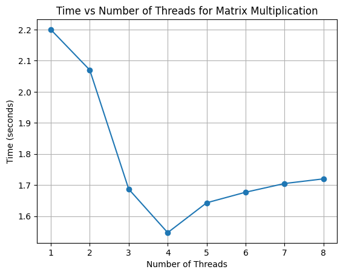
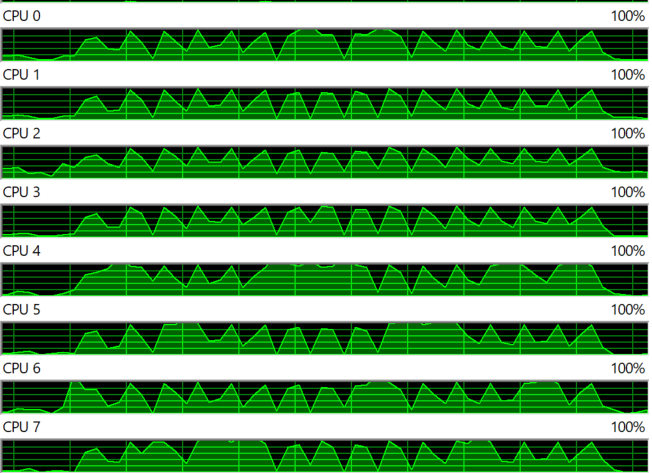

# Matrix Multiplication with Multithreading

This Python script demonstrates matrix multiplication using multithreading and measures the execution time with varying numbers of threads.

## Usage

Ensure Python is installed, then execute the script:

- `python Multithreading.py`

## Execution Time (seconds) vs Number of Threads:

| Threads | 1 | 2 | 3 | 4 | 5 | 6 | 7 | 8 |
|---------|---|---|---|---|---|---|---|---|
| Time    | 2.20 | 2.07 | 1.687 | 1.547 | 1.643 | 1.677 | 1.705 | 1.72 |

## Resource Usage

